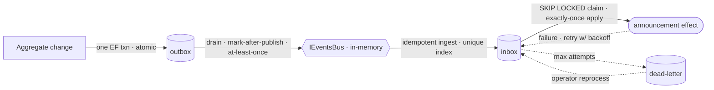

# Modulith Reliability Kit

[](https://github.com/qwertyboy0325/modulith-reliability-kit/actions/workflows/ci.yml)

A .NET 8 **modular-monolith / DDD** backend that treats **cross-module messaging reliability**
as a first-class design concern.

It is not a generic scaffolding template. It is a small, runnable reference implementation plus a
written engineering case study: what to copy, what to copy *with changes*, and what *not* to copy
from real modular-monolith systems — grounded in source, not slideware.

## What this demonstrates

- **Reliability judgment for distributed-ish systems.** The central thesis — *durable publish is not
  durable delivery* — is worked out end to end: transactional outbox, idempotent inbox, retry, and
  dead-letter, with every integration event classified by its real delivery guarantee. The guarantees
  are pinned by integration tests against a real PostgreSQL (crash recovery, exactly-once, idempotent
  redelivery, dead-letter) — not just asserted in prose.
- **Reverse-engineering and design extraction.** Two real-world modular-monolith codebases were read
  bottom-up and distilled into a copyable rule set. See
  [`docs/09-lessons-learned/architecture-rules-for-my-own-project.md`](docs/09-lessons-learned/architecture-rules-for-my-own-project.md).
- **Boundaries enforced by tests, not conventions.** Module isolation and layer direction are checked
  by architecture tests, not just documented.

## The reliability model (core idea)

Each hop in a cross-module event flow has a *different* guarantee. Conflating them is how
"the database changed but nobody was notified, with no record" bugs happen.



Each edge is a claim with a home in the code and a test that pins it — see the
[verification map](#verify-the-claims-guarantee--code--test) below. The bus is in-memory by default; an
opt-in NATS JetStream transport makes the same publish→consume path durable across processes (same
diagram, real broker).

| Hop | Mechanism | Guarantee |
| --- | --------- | --------- |
| Aggregate change → outbox row | single EF transaction | atomic (transactional outbox) |
| Outbox row → bus publish | background processor, mark-after-publish | at-least-once (consumers must be idempotent) |
| Bus → consumer (durable) | inbox ingest + retry + dead-letter + operator reprocess | at-least-once, dead-lettered, and recoverable |
| Direct publish (no outbox) | best-effort only | droppable — allowed *only* if explicitly classified |

Full analysis and the per-event classification method:
[`docs/05-events-and-messaging/reliability-matrix.md`](docs/05-events-and-messaging/reliability-matrix.md)
and [`integration-events.md`](docs/05-events-and-messaging/integration-events.md).

## Verify the claims (guarantee → code → test)

The reliability claims above are not prose — each one has a specific place it is enforced and a test
that pins it. This table is the fast path for a reviewer who wants to check the work, not take it on
faith.

| Guarantee | Enforced in | Pinned by test |
| --------- | ----------- | -------------- |
| Aggregate change + outbox row commit **atomically** (one transaction) | [`UnitOfWorkBehavior.cs`](src/BuildingBlocks/ModulithReliabilityKit.BuildingBlocks.Infrastructure/Pipeline/UnitOfWorkBehavior.cs) | [`CatalogProductWriteReliabilityTests`](src/Tests/ModulithReliabilityKit.IntegrationTests/Catalog/CatalogProductWriteReliabilityTests.cs) · `Creating_A_Product_Commits_The_Aggregate_And_Outbox_Row_Together` |
| Outbox publish is **at-least-once**; an unpublished row is re-published **exactly once** after a crash | [`CatalogOutboxProcessor.cs`](src/Modules/Catalog/ModulithReliabilityKit.Modules.Catalog.Infrastructure/Processing/CatalogOutboxProcessor.cs) · [`OutboxProcessorBase.cs`](src/BuildingBlocks/ModulithReliabilityKit.BuildingBlocks.Infrastructure/Processing/OutboxProcessorBase.cs) | [`CatalogOutboxReliabilityTests`](src/Tests/ModulithReliabilityKit.IntegrationTests/Catalog/CatalogOutboxReliabilityTests.cs) · `Unpublished_Outbox_Row_Is_Republished_Exactly_Once_After_Restart` |
| Inbox ingest is **idempotent** (duplicate delivery ⇒ one row, one effect) | [`InboxWriter.cs`](src/Modules/Notifications/ModulithReliabilityKit.Modules.Notifications.Infrastructure/Inbox/InboxWriter.cs) | [`NotificationsInboxReliabilityTests`](src/Tests/ModulithReliabilityKit.IntegrationTests/Notifications/NotificationsInboxReliabilityTests.cs) · `Duplicate_Delivery_Produces_Exactly_One_Inbox_Row_And_One_Effect` |
| Inbox apply is **transactional exactly-once**; a crash mid-apply rolls back and recovers | [`NotificationsInboxProcessor.cs`](src/Modules/Notifications/ModulithReliabilityKit.Modules.Notifications.Infrastructure/Processing/NotificationsInboxProcessor.cs) | `NotificationsInboxReliabilityTests` · `Crash_After_Staging_Effect_Rolls_Back_And_Recovers_Exactly_Once` |
| Inbox apply is **multi-instance safe**: concurrent drainers claim rows with `FOR UPDATE SKIP LOCKED`, so a message is applied exactly once (no double effect, no spurious failure) | [`NotificationsInboxProcessor.cs`](src/Modules/Notifications/ModulithReliabilityKit.Modules.Notifications.Infrastructure/Processing/NotificationsInboxProcessor.cs) | [`InboxConcurrencyReliabilityTests`](src/Tests/ModulithReliabilityKit.IntegrationTests/Notifications/InboxConcurrencyReliabilityTests.cs) · `A_Row_Claimed_By_One_Processor_Is_Skipped_By_A_Concurrent_Processor` |
| **Retry** with back-off, then **dead-letter** after max attempts | [`InboxRetryPolicy.cs`](src/BuildingBlocks/ModulithReliabilityKit.BuildingBlocks.Application/Inbox/InboxRetryPolicy.cs) | [`InboxRetryPolicyTests`](src/Tests/ModulithReliabilityKit.ReliabilityTests/Inbox/InboxRetryPolicyTests.cs) (unit) · `NotificationsInboxReliabilityTests.Repeated_Failures_Dead_Letter_The_Message_After_Max_Attempts` |
| **Dead-letter recovery**: a poisoned message can be requeued and applied **exactly once**; the dead-letter is marked resolved atomically; re-runs are no-ops | [`InboxDeadLetterReprocessor.cs`](src/Modules/Notifications/ModulithReliabilityKit.Modules.Notifications.Infrastructure/Inbox/InboxDeadLetterReprocessor.cs) | [`InboxDeadLetterReprocessTests`](src/Tests/ModulithReliabilityKit.IntegrationTests/Notifications/InboxDeadLetterReprocessTests.cs) · `Reprocessing_A_Dead_Letter_Requeues_It_And_Applies_The_Effect_Exactly_Once` |
| End-to-end: create ⇒ durable consume ⇒ **exactly one** announcement; redelivery absorbed idempotently | wiring in [`Program.cs`](src/Api/ModulithReliabilityKit.Api/Program.cs) | [`CrossModuleReliabilityE2ETests`](src/Tests/ModulithReliabilityKit.IntegrationTests/CrossModule/CrossModuleReliabilityE2ETests.cs) (2 tests) |
| Same story through the **HTTP surface** (create via API ⇒ read announcement via API) | API endpoints in `Program.cs` | [`CatalogToNotificationsHttpE2ETests`](src/Tests/ModulithReliabilityKit.IntegrationTests/Http/CatalogToNotificationsHttpE2ETests.cs) |
| Cross-module references allowed **only** via `IntegrationEvents`; layer direction | project boundaries | [`ArchitectureTests`](src/Tests/ModulithReliabilityKit.ArchitectureTests) |
| **Durable, cross-process transport** (opt-in): publish is persisted before it counts as delivered; delivery is at-least-once across processes | [`NatsEventBus.cs`](src/BuildingBlocks/ModulithReliabilityKit.BuildingBlocks.Infrastructure/Events/NatsEventBus.cs) (NATS JetStream) | [`NatsCrossProcessReliabilityTests`](src/Tests/ModulithReliabilityKit.IntegrationTests/Messaging/NatsCrossProcessReliabilityTests.cs) |
| **Observability**: inbox outcomes (processed / retried / dead-lettered) are emitted as metrics from the real drain path, scrapeable at `/metrics` | [`ReliabilityMetrics.cs`](src/BuildingBlocks/ModulithReliabilityKit.BuildingBlocks.Infrastructure/Diagnostics/ReliabilityMetrics.cs) | [`ReliabilityMetricsInstrumentationTests`](src/Tests/ModulithReliabilityKit.IntegrationTests/Notifications/ReliabilityMetricsInstrumentationTests.cs) |

**60-second tour** (if you only read three files): the model in
[`reliability-matrix.md`](docs/05-events-and-messaging/reliability-matrix.md) → the hard part
([`NotificationsInboxProcessor.cs`](src/Modules/Notifications/ModulithReliabilityKit.Modules.Notifications.Infrastructure/Processing/NotificationsInboxProcessor.cs):
transactional exactly-once + retry + dead-letter) → the guarantees proven end-to-end
([`CrossModuleReliabilityE2ETests.cs`](src/Tests/ModulithReliabilityKit.IntegrationTests/CrossModule/CrossModuleReliabilityE2ETests.cs)).

## Implementation status

This is an actively-built kit. Stated honestly so the code and the claims match:

| Capability | Status |
| ---------- | ------ |
| BuildingBlocks (Domain / Application / Infrastructure), MediatR-free domain | Implemented |
| Explicit-transaction Unit of Work, decorator pipeline (validation → UoW → logging) | Implemented |
| Two reference modules (`Catalog` producer, `Notifications` consumer) with module facades + typed module persistence | Implemented |
| Transactional **outbox** (publish path) + PostgreSQL migrations | Implemented |
| Durable **inbox** consumer (idempotent ingest, retry, dead-letter) wired end-to-end | Implemented |
| **Dead-letter recovery**: list + reprocess (requeue, apply-once) via Notifications facade & admin endpoints | Implemented |
| **Multi-instance safe** inbox drain (`FOR UPDATE SKIP LOCKED` row claim) proven by a concurrent-processor test | Implemented |
| Opt-in **durable cross-process transport** (NATS JetStream) behind the existing `IEventsBus`; in-memory remains the default | Implemented |
| **Observability**: reliability metrics (publish/processed/retried/dead-lettered/reprocessed/redelivered) on Prometheus `/metrics` + spans; traces via opt-in OTLP | Implemented |
| End-to-end durable consume across a **second module** | Implemented |
| Reliability **integration tests on real PostgreSQL** (Testcontainers): idempotency, crash recovery, dead-letter, cross-module e2e | Implemented |
| **HTTP-level e2e** (WebApplicationFactory): create product via API → durable consume → announcement readable via API | Implemented |
| Architecture tests enforcing module isolation + layering | Implemented |
| CI pipeline (build + arch/unit/integration tests on every push & PR) | Implemented |

## Architecture at a glance

```text
API host (single container, decorator pipeline, arch tests)
        │ composes
        ▼
Modules/<Context>/ {Domain, Application, Infrastructure, IntegrationEvents}
        │ cross-module references allowed ONLY via IntegrationEvents
        ▼
BuildingBlocks/ {Domain, Application, Infrastructure}
```

Only each module's `IntegrationEvents` project is a public cross-module contract — enforced by
[`src/Tests/ModulithReliabilityKit.ArchitectureTests`](src/Tests/ModulithReliabilityKit.ArchitectureTests).

## Run it

Prefer a guided tour? [`DEMO.md`](DEMO.md) is a ~5-minute runnable walkthrough (live durable path +
the failure-path guarantees proven by tests), with a recording script. Reliability metrics are scrapeable
at `GET /metrics` (Prometheus); see [`docs/08-operational-concerns/observability.md`](docs/08-operational-concerns/observability.md).

```bash
dotnet build src/ModulithReliabilityKit.sln
dotnet test src/ModulithReliabilityKit.sln   # integration tests spin up throwaway PostgreSQL via Testcontainers (Docker required)
docker compose -f docker-compose.postgres.yml up -d
dotnet run --project src/Api/ModulithReliabilityKit.Api/ModulithReliabilityKit.Api.csproj --urls http://localhost:5099
```

The architecture and reliability-policy unit tests run without Docker; the `IntegrationTests` project
requires a running Docker daemon (it starts its own `postgres:16-alpine` containers and applies the
module migrations).

Create and read a sample product:

```bash
curl -X POST "http://localhost:5099/catalog/products/" \
  -H "Content-Type: application/json" \
  -d '{"name":"Demo Product","price":12.50,"currency":"usd"}'

curl "http://localhost:5099/catalog/products/{id}"
```

PostgreSQL demo runbook:
[`docs/10-skeleton/applied-improvements-and-postgres-demo.md`](docs/10-skeleton/applied-improvements-and-postgres-demo.md).

## Documentation map

Read in order; the notes are written bottom-up (foundations first).

- [`docs/README.md`](docs/README.md) — how the case study is structured and how to read it.
- `docs/00-orientation/` — project shape and a reading order.
- `docs/01-foundation/` — building blocks and dependency injection.
- `docs/02-application-pipeline/` — unit of work.
- `docs/05-events-and-messaging/` — **integration events + reliability matrix** (the heart of this kit).
- `docs/07-module-architecture/` — module boundaries and the DDD-reference comparison.
- `docs/09-lessons-learned/` — the extracted architecture rule set.
- `docs/10-skeleton/` — what was actually built and why.
- `docs-tw/` — Traditional Chinese mirror of the same notes.

## Reference material and attribution

This kit was built by studying modular-monolith / DDD reference codebases **and** by distilling
problems hit while operating a real production system.

**Primary architectural reference — Kamil Grzybek's
[Modular Monolith with DDD](https://github.com/kgrzybek/modular-monolith-with-ddd)**, the
widely-cited open-source reference for modular monoliths in .NET. The module layout
(`Domain` / `Application` / `Infrastructure` / `IntegrationEvents`), the internal-command / outbox /
inbox vocabulary, and the "boundaries enforced by architecture tests" discipline follow its lead.
Where this kit deliberately diverges — e.g. a transaction-safe inbox processor instead of a shared
process-then-mark base — the notes say so.

**Informed by real-world problems (de-identified).** The reliability thesis is not academic — it
distills failure modes the author has hit while operating high-throughput, multi-tenant modular
monoliths in production. The examples below are **generalized on purpose**: no employer, product,
dataset, or proprietary identifier is referenced. What is shared is the *engineering shape* of the
problem and the design decision this kit makes in response.

- **"The database changed but the effect silently didn't happen."** Under load, asynchronous
  cross-module event processing can stall when a shared resource is exhausted — e.g. a connection
  pool starved because a compatibility/legacy adapter leaks pooled connections through
  non-deterministic disposal, which then cascades into background jobs. *Design decision in this
  kit:* background/async consumption runs in **bounded, explicitly-scoped units of work with
  deterministic resource lifetime** (scoped integration-event handlers + explicit-transaction UoW +
  a dedicated durable inbox processor), never ad-hoc data access inside a handler.
- **Silent multi-tenant isolation failure.** Defense-in-depth tenant isolation (ORM query filters +
  database row-level security) can behave unexpectedly when a connection is opened outside the path
  that sets the required tenant-scoping session state — returning empty results and blocking
  legitimate work instead of only unauthorized access. *Design decision in this kit:* each module
  owns its `DbContext` and persistence wiring is deliberate and per-module, never implicit.
- **Write amplification on a high-throughput ingest path.** At hundreds of millions of writes/day, an
  unconditional upsert of "latest state" on every packet turned into an ~100% update ratio and dead
  tuples past ~80% of the table (MVCC marks each `UPDATE`'s old version dead), degrading the whole
  store faster than autovacuum could recover it. *Design lesson (write-path sibling of the kit's
  idempotency):* make writes **conditional** (only when something materially changed), keep hot
  mutable state off the durable per-event path (write-behind on a bounded interval), and compress /
  retain history by policy with **lock-aware, non-blocking** maintenance. Full de-identified write-up:
  [`docs/09-lessons-learned/high-write-time-series-ingest.md`](docs/09-lessons-learned/high-write-time-series-ingest.md).

The distilled rule set lives in
[`docs/09-lessons-learned/architecture-rules-for-my-own-project.md`](docs/09-lessons-learned/architecture-rules-for-my-own-project.md).
The case-study notes are written against this repository's own neutral domain (Catalog /
Notifications) and carry no proprietary identifiers. Any reference codebases studied while building
this kit are kept locally under `ref/` and are **intentionally git-ignored** — study material only,
neither part of nor reproduced in this repository.

If `ref/` was ever tracked, remove it from the index once:

```bash
git rm -r --cached ref
```

## Scope, provenance, and AI-assisted authorship

To set clear expectations for anyone evaluating this repository:

- **What this is.** A purpose-built reference implementation plus a written case study on cross-module
  messaging reliability. It is *not* a copy, fork, or export of any production system.
- **No proprietary material.** It contains no source code, data, schemas, credentials, employer or
  product names, or tenant information from the systems or third-party codebases that informed it.
  The real-world problems described above are **generalized and de-identified** — real names,
  identifiers, connection details, and business specifics are removed; only the vendor-neutral
  engineering problem/solution shape is retained, and nothing here is traceable to a specific private
  system.
- **Study material stays out of the repo.** The reference codebases under `ref/` (including the public
  reference project) are kept locally for study only and are **git-ignored** — they are not
  redistributed here.
- **AI-assisted, author-directed.** The code, the documentation, and this case study were refined with
  substantial AI assistance — drafting, refactoring, distillation, and de-identification. The
  architectural judgment, the reliability thesis, the design trade-offs, and the production experience
  behind them are the author's; the AI was a tool for turning that into a clean, tested, and verifiable
  artifact. Every claim here is backed by the code and tests it links to, so it can be checked directly
  rather than taken on trust.

## Renaming / reuse

The repository code namespace is `ModulithReliabilityKit`. A helper script can rebrand the skeleton to
a different product/module name if you want to reuse it as a starting point — see
[`TEMPLATE.md`](TEMPLATE.md). Reuse is a secondary use case; the primary purpose of this repo is the
reliability reference implementation and the case study above.
