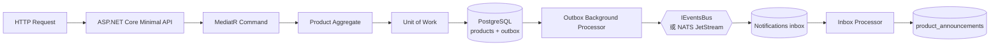

# C# 專案快速導覽：從建立商品到可靠事件處理

> 給面試官與 C#／.NET 工程師的快速閱讀版，約 8–10 分鐘。
>
> [English README](../../README.md) · [完整中文文件](../README.md) · [可執行 Demo](../../DEMO.md)

## 一句話介紹

**Handoff Semantics 是一個 .NET 8 / C# 的模組化單體參考專案。**

它用一個刻意簡化的情境——「Catalog 建立商品後，Notifications 建立通知資料」——展示以下問題如何在真實資料庫交易中被處理：

- EF Core 寫入成功，但事件還沒送出去時怎麼辦？
- 同一個事件被重複投遞時，如何避免重複執行？
- 多個背景 worker 同時處理同一批資料時，如何避免競爭條件？
- 處理失敗後，如何重試、退避、進入 dead letter，再由操作人員重新處理？

這不是商城範例，也不是可直接安裝的訊息框架。它的重點是把 **DDD、EF Core、MediatR、Event-Driven Architecture 與 PostgreSQL concurrency** 放進同一條可執行、可測試的 C# 流程中。

## 這個專案在解決什麼問題？

很多系統會直覺地寫成：

```csharp
await dbContext.SaveChangesAsync();
await eventBus.Publish(productCreated);
```

但這兩個動作不是同一個 transaction：

1. 商品已經成功寫入 PostgreSQL。
2. 程式在 publish 前 crash，或訊息系統暫時失敗。
3. 資料庫裡有商品，但下游永遠不知道商品已建立。

反過來，如果先 publish 再 commit，也可能讓下游收到一個最後沒有成功寫入的商品。

這個專案使用 **Transactional Outbox** 解決這個 database-to-message handoff：商品與待發送事件先由 EF Core 寫進同一筆資料庫 transaction；背景處理器再從 outbox 發送事件。消費端則使用 **Inbox** 去重、重試並記錄 dead letter。

## 一條流程看懂整個專案



最重要的兩個 transaction boundary 是：

1. **Catalog：** `Product` 的狀態變更與 outbox row 一起 commit。
2. **Notifications：** 本地業務效果與 inbox 的 `processed` 狀態一起 commit。

因此專案承諾的是「本地資料庫效果可做到 exactly-once apply」，不是宣稱 HTTP、Email、付款或整個分散式系統都能 end-to-end exactly once。

## 常見 .NET 架構概念，在這裡各自負責什麼？

| 概念 | 在本專案中的角色 | 實際價值 |
| --- | --- | --- |
| **ASP.NET Core Minimal API** | 接收 HTTP request，轉成 command/query | API 層保持薄，不放商業規則 |
| **DDD** | `Product` aggregate、`Money` value object、business rule、domain event | 規則與狀態變更集中在 domain model |
| **CQRS + MediatR** | Command 修改狀態，Query 讀取資料；pipeline behavior 包裝 command | 把 validation、transaction、logging 從 handler 抽離 |
| **EF Core + Npgsql** | `DbContext`、mapping、transaction、PostgreSQL row lock | 以常見 .NET ORM 實作真正的 persistence boundary |
| **Unit of Work** | Command handler 完成後，由 pipeline 統一 commit | Handler 不需要到處呼叫 `SaveChanges` |
| **Modular Monolith** | `Catalog` 與 `Notifications` 是同一個部署單位中的獨立模組 | 保留單體的部署簡單度，同時限制模組 coupling |
| **Integration Event** | 模組之間只共享公開事件契約 | Notifications 不需要引用 Catalog 的 Domain 或 Infrastructure |
| **Transactional Outbox** | 商品與待發事件在同一個 transaction 寫入 | 避免 database commit 成功但事件無紀錄地遺失 |
| **Idempotent Inbox** | 使用唯一鍵吸收重複投遞 | 接受 at-least-once delivery，而不是假設訊息只來一次 |
| **Background Processing** | Outbox drain、Inbox drain、retry、dead letter | 將非同步工作做成可恢復的持久狀態機 |
| **xUnit + Testcontainers** | 使用真實 PostgreSQL 驗證 transaction 與 concurrency | 不只用 mock 證明資料庫語義 |
| **Architecture Tests** | 驗證模組與分層依賴方向 | 將架構規則變成 CI 可執行的約束 |

## 跟著一個 `CreateProduct` request 讀 C# 程式

### 1. HTTP 只負責轉接

[`CatalogEndpoints.cs`](../../src/Api/ModulithReliabilityKit.Api/Modules/CatalogEndpoints.cs) 將 `POST /catalog/products` 轉成 `CreateProductCommand`，再交給 Catalog module 執行。

API 不直接操作 `DbContext`，也不在 endpoint 裡寫商業規則。

### 2. Command Handler 組織 use case

[`CreateProductCommandHandler.cs`](../../src/Modules/Catalog/ModulithReliabilityKit.Modules.Catalog.Application/Products/CreateProduct/CreateProductCommandHandler.cs) 做的事情很少：

1. 呼叫 domain model 建立 `Product`。
2. 透過 repository 加入 aggregate。
3. 回傳新的 ID。

它刻意**不呼叫 `SaveChanges`**。Transaction 由 MediatR pipeline 統一管理，避免每個 handler 各自決定 commit 時機。

### 3. DDD Aggregate 保護規則

[`Product.cs`](../../src/Modules/Catalog/ModulithReliabilityKit.Modules.Catalog.Domain/Products/Product.cs) 是 aggregate root：

- `Create` 與 `Rename` 是有語意的方法，不是讓外部任意改 property。
- 名稱規則由 domain rule 驗證。
- `Money` 是 value object。
- 建立商品時記錄 `ProductCreatedDomainEvent`。
- EF Core 使用 private constructor materialize entity，但 setter 仍保持 private。

這是一個小型但完整的 DDD tactical pattern 範例；業務領域刻意保持簡單，讓 transaction 與事件可靠性容易被檢查。

### 4. EF Core 負責 persistence mapping

[`CatalogContext.cs`](../../src/Modules/Catalog/ModulithReliabilityKit.Modules.Catalog.Infrastructure/CatalogContext.cs) 管理 `Product` 與 `OutboxMessage`；[`ProductEntityTypeConfiguration.cs`](../../src/Modules/Catalog/ModulithReliabilityKit.Modules.Catalog.Infrastructure/Domain/Products/ProductEntityTypeConfiguration.cs) 則定義：

- strongly typed `ProductId` 如何映射；
- `Money` 如何用 owned type 存成 `price_amount` 與 `price_currency`；
- domain events 不進資料表；
- Catalog 使用自己的 PostgreSQL schema。

Notifications 也有自己的 [`NotificationsContext`](../../src/Modules/Notifications/ModulithReliabilityKit.Modules.Notifications.Infrastructure/NotificationsContext.cs) 與 schema。這使模組在同一個 application process 中，仍維持清楚的資料所有權。

### 5. MediatR Pipeline 定義 transaction boundary

[`UnitOfWorkBehavior.cs`](../../src/BuildingBlocks/ModulithReliabilityKit.BuildingBlocks.Infrastructure/Pipeline/UnitOfWorkBehavior.cs) 只在 request 是 Command 時執行 commit。

真正的 transaction 在 [`ModuleUnitOfWork.cs`](../../src/BuildingBlocks/ModulithReliabilityKit.BuildingBlocks.Infrastructure/ModulePersistence/ModuleUnitOfWork.cs)：

1. 開啟 EF Core transaction。
2. Dispatch aggregate 記錄的 domain events。
3. `SaveChangesAsync`。
4. Commit；任何例外則 rollback。

這代表 domain event handler 新增的 outbox row，會和 aggregate 變更在同一筆 transaction 中寫入。

### 6. Domain Event 轉成公開 Integration Event

[`ProductCreatedNotificationHandler.cs`](../../src/Modules/Catalog/ModulithReliabilityKit.Modules.Catalog.Application/Products/Events/ProductCreatedNotificationHandler.cs) 將進程內的 domain event 轉成 [`ProductCreatedIntegrationEvent`](../../src/Modules/Catalog/ModulithReliabilityKit.Modules.Catalog.IntegrationEvents/ProductCreatedIntegrationEvent.cs)，序列化後加入 outbox。

這裡刻意區分：

- **Domain Event：** Catalog 內部的領域事實。
- **Integration Event：** 給其他模組使用的穩定公開契約。
- **Outbox Message：** Integration Event 的持久化傳輸表示。

其他模組只引用 `Catalog.IntegrationEvents`，不直接碰 Catalog 的 Domain、Application 或 Infrastructure。

### 7. Outbox 在 commit 後發送

[`CatalogOutboxProcessor.cs`](../../src/Modules/Catalog/ModulithReliabilityKit.Modules.Catalog.Infrastructure/Processing/CatalogOutboxProcessor.cs) 會：

1. 讀取尚未處理的 outbox rows。
2. 還原 Integration Event。
3. 透過 `IEventsBus` 發送。
4. **成功 publish 後**才標記為 processed。

如果程式在 publish 成功後、標記 processed 前 crash，事件會再次送出。這是刻意接受的 **at-least-once** 行為，因此消費者必須能處理 duplicate。

預設可使用 process 內的 event bus，也提供 opt-in NATS JetStream transport；可靠性邏輯並不依賴某個特定 broker 幫應用程式「自動做到 exactly once」。

### 8. Inbox 先持久化，再執行效果

[`InboxWriter.cs`](../../src/Modules/Notifications/ModulithReliabilityKit.Modules.Notifications.Infrastructure/Inbox/InboxWriter.cs) 以 `(logical_id, occurred_on_utc)` 唯一索引作為去重的最終依據。即使兩個 delivery 同時通過先行查詢，PostgreSQL unique constraint 仍會阻止第二筆重複資料。

[`NotificationsInboxProcessor.cs`](../../src/Modules/Notifications/ModulithReliabilityKit.Modules.Notifications.Infrastructure/Processing/NotificationsInboxProcessor.cs) 則負責：

- 使用 `FOR UPDATE SKIP LOCKED` 讓多個 worker 安全 claim 工作；
- 在同一個 transaction 中執行本地效果並標記 processed；
- rollback 失敗的業務變更；
- 依 retry policy 安排退避；
- 超過次數後寫入 dead-letter table；
- 重新 claim row，避免失敗紀錄覆蓋另一個 worker 已完成的成功結果。

最後由 [`ProductCreatedInboxDispatcher.cs`](../../src/Modules/Notifications/ModulithReliabilityKit.Modules.Notifications.Application/ProductAnnouncements/ProductCreatedInboxDispatcher.cs) 將事件套用成 Notifications 自己擁有的 `ProductAnnouncement` read model。

## 為什麼它不只是另一個 CRUD 範例？

一般 CRUD 範例通常只展示 Controller、Service、Repository 與資料表。這個專案額外把幾個容易在 production 出問題的邊界做成明確設計：

- database transaction 與 message publish 之間不是原子的；
- at-least-once delivery 必然要求 consumer idempotency；
- `FOR UPDATE SKIP LOCKED` 只保護 claim，不會自動保護後續另一筆 transaction；
- retry 狀態本身也可能與其他 worker 的成功結果競爭；
- 「exactly once」必須說清楚只涵蓋哪一個 local effect；
- 架構與可靠性 claim 必須由測試對應，而不是只靠 README 宣稱。

其中較深入的 concurrency 問題，可直接閱讀 [`FOR UPDATE SKIP LOCKED` stale failure-write race case study](../09-lessons-learned/inbox-stale-failure-write-race.md)。

## 面試時可以討論的設計判斷

這個專案適合延伸討論以下 trade-offs：

- 為什麼選 modular monolith，而不是一開始拆 microservices？
- Domain Event 與 Integration Event 為什麼不共用同一個 class？
- 為什麼 `SaveChanges` 放在 pipeline，而不是 command handler？
- Outbox 為什麼是 mark-after-publish，而不是先標記再 publish？
- Inbox 的 unique constraint 為什麼比單純的 existence check 更重要？
- `SKIP LOCKED` 適合什麼 worker 模型，又沒有解決哪些 race？
- 哪些本地副作用可以宣稱 exactly-once apply；哪些外部副作用仍只能靠 idempotency key、reconciliation 或補償流程？
- 如果改成 Kafka、RabbitMQ、Azure Service Bus 或 Dapr，哪些 application-level contract 仍然不會消失？

## 技術堆疊

- C# / .NET 8
- ASP.NET Core Minimal API
- Entity Framework Core 8 + Npgsql + PostgreSQL
- MediatR + FluentValidation
- In-memory Event Bus；opt-in NATS JetStream
- xUnit + Testcontainers for PostgreSQL
- NetArchTest 架構測試
- OpenTelemetry + Serilog

## 建議閱讀路線

### 只有 5 分鐘

1. 本頁的流程圖。
2. [`Product.cs`](../../src/Modules/Catalog/ModulithReliabilityKit.Modules.Catalog.Domain/Products/Product.cs)。
3. [`ModuleUnitOfWork.cs`](../../src/BuildingBlocks/ModulithReliabilityKit.BuildingBlocks.Infrastructure/ModulePersistence/ModuleUnitOfWork.cs)。
4. [`ProductCreatedNotificationHandler.cs`](../../src/Modules/Catalog/ModulithReliabilityKit.Modules.Catalog.Application/Products/Events/ProductCreatedNotificationHandler.cs)。
5. [`NotificationsInboxProcessor.cs`](../../src/Modules/Notifications/ModulithReliabilityKit.Modules.Notifications.Infrastructure/Processing/NotificationsInboxProcessor.cs) 的 class summary 與 transaction 區段。

### 想確認可靠性證據

- [`reliability-matrix.md`](../05-events-and-messaging/reliability-matrix.md) — 每一項 guarantee 對應的實作與測試。
- [`CrossModuleReliabilityE2ETests.cs`](../../src/Tests/ModulithReliabilityKit.IntegrationTests/CrossModule/CrossModuleReliabilityE2ETests.cs) — Catalog → Outbox → Bus → Inbox → Notifications 的跨模組流程。
- [`InboxConcurrencyReliabilityTests.cs`](../../src/Tests/ModulithReliabilityKit.IntegrationTests/Notifications/InboxConcurrencyReliabilityTests.cs) — 多 worker 與 race condition。
- [`CatalogProductWriteReliabilityTests.cs`](../../src/Tests/ModulithReliabilityKit.IntegrationTests/Catalog/CatalogProductWriteReliabilityTests.cs) — aggregate 與 outbox 的 atomic write。

### 想理解完整專案結構

- [`project-map.md`](project-map.md) — solution、BuildingBlocks、Modules、Tests 的地圖。
- [`source-code-reading-order.md`](source-code-reading-order.md) — 自下而上的完整原始碼閱讀順序。
- [`DEMO.md`](../../DEMO.md) — 實際執行正常流程、失敗流程與雙 instance demo。

## 範圍與限制

這個 repository 是 **reference implementation + case study**，不是 production-ready messaging framework：

- 不保證 HTTP、Email、Webhook、Payment 等外部副作用 exactly once。
- 不提供 broker HA、multi-region、全域 ordering、throughput planning 或完整 backpressure 設計。
- 測試證據的 topology 與 fault model 有明確邊界，不能直接外推為大規模 production benchmark。
- NATS JetStream 是可替換的 transport example；真正值得檢查的是應用層的 identity、transaction、idempotency、retry 與 concurrency contract。

這些限制是專案設計的一部分：可靠性主張只有在邊界被說清楚、而且能由 C# 程式與測試驗證時才有意義。
