# Container view（高階流程）

Diagram-as-code（Mermaid），由 GitHub 渲染。原始碼與程式一起版本控制 —— 不需匯出圖片或額外 hosting。

> 英文版對照：`docs/architecture/container-view.md`。

一個生產者模組（`Catalog`）發出一個 integration event；一個消費者模組（`Notifications`）套用它。
**每一個 hop 的保證都不同** —— 把它們混為一談，正是「資料庫改了、卻沒人被通知、也沒有紀錄」這類 bug 的來源。
每事件的分類方法見
[`../05-events-and-messaging/reliability-matrix.md`](../05-events-and-messaging/reliability-matrix.md)。

```mermaid
flowchart LR
  subgraph Catalog["Catalog module · producer"]
    AGG["Aggregate change"]
  end
  OB[("PostgreSQL outbox")]
  PUB["Outbox publisher<br/>background drain"]
  BUS{{"Event transport<br/>in-memory default · NATS JetStream opt-in"}}
  IN[("PostgreSQL inbox")]
  subgraph Notifications["Notifications module · consumer"]
    FX(["Announcement effect<br/>local DB write"])
  end
  EXT[/"External effect<br/>HTTP · email · webhook · payment"/]

  AGG -->|"atomic local transaction<br/>aggregate + outbox row · one EF txn"| OB
  OB --> PUB
  PUB -->|"at-least-once publish<br/>publish then mark · NATS awaits PubAck before mark"| BUS
  BUS -->|"idempotent ingest<br/>dedup on logical_id + occurred_on_utc"| IN
  IN -->|"exactly-once local apply<br/>FOR UPDATE SKIP LOCKED · effect + processed mark in one txn"| FX
  FX -.->|"outside the guarantee · not covered by this kit"| EXT
```

## 箭頭語意

| Hop | 保證（guarantee） | 實作於 |
| --- | --------- | ----------- |
| Aggregate change → outbox | atomic local transaction（aggregate 與 outbox row 同一交易提交） | `UnitOfWorkBehavior` |
| Outbox → transport | at-least-once publish（先 publish 再 mark；兩者之間 crash 會重發，由下游吸收）。NATS 會先取得 `PubAck` 才讓 outbox 標記該列。 | `CatalogOutboxProcessor` · `OutboxProcessorBase` · `NatsEventBus` |
| Transport → inbox | idempotent ingest（以 `(logical_id, occurred_on_utc)` 去重） | `InboxWriter` |
| Inbox → local effect | exactly-once **local** apply（`FOR UPDATE SKIP LOCKED`；effect 與 `processed` 標記同一交易） | `NotificationsInboxProcessor` |
| Local effect → external | **不在保證範圍內** —— 內建 dispatcher 只寫入同一個資料庫 | — |

完整邊界與 fault model 見 README 的
[Guarantee boundaries & non-goals](../../README.md#guarantee-boundaries--non-goals)。失敗與回復路徑
（retry、dead-letter、失敗記錄）見 [`handoff-components.md`](handoff-components.md)。
