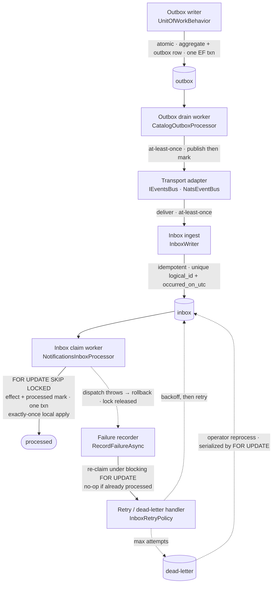

# Handoff components & failure boundaries（元件與失敗邊界）

Diagram-as-code（Mermaid）。[`container-view.md`](container-view.md) 呈現高階流程；本頁呈現
**擁有每個 handoff 的元件**,更重要的是 **失敗與回復路徑跑在哪裡**。

> 英文版對照：`docs/architecture/handoff-components.md`。

實線是 happy path;**虛線是失敗／回復路徑**。

## 元件 → 程式

| 元件 | 程式 | 由測試釘住 |
| --------- | ---- | --------- |
| Outbox writer | `UnitOfWorkBehavior` | `CatalogProductWriteReliabilityTests` |
| Outbox drain worker | `CatalogOutboxProcessor` · `OutboxProcessorBase` | `CatalogOutboxReliabilityTests` |
| Transport adapter | `IEventsBus`（in-memory）· `NatsEventBus`（JetStream） | `NatsCrossProcessReliabilityTests` |
| Inbox ingest | `InboxWriter` | `NotificationsInboxReliabilityTests` |
| Inbox claim worker | `NotificationsInboxProcessor` | `InboxConcurrencyReliabilityTests` |
| Failure recorder | `RecordFailureAsync`（於 `NotificationsInboxProcessor`） | `InboxConcurrencyReliabilityTests` |
| Retry / dead-letter handler | `InboxRetryPolicy` · `InboxDeadLetterReprocessor` | `InboxRetryPolicyTests` · `InboxDeadLetterReprocessTests` |

## 失敗邊界

- **Exactly-once *local* apply。** effect 與 `processed` 標記同一交易提交;失敗會 rollback 並回復。併發
  drainer 以 `FOR UPDATE SKIP LOCKED` claim 該列,因此本地 effect 不會被重複套用。
- **失敗記錄同樣受鎖保護。** rollback 之後,失敗記錄跑在*另一個*交易。它以**阻塞式** `FOR UPDATE` 重新
  claim 該列,若另一 drainer 已設定 `processed_on_utc` 就 no-op —— 因此落敗的 drainer 無法用過期的
  `retrying`／dead-letter 狀態或指標覆蓋成功。這關閉了一個由 claim 稽核發現、以 test-first 修正的競態,
  見案例:
  [`../09-lessons-learned/inbox-stale-failure-write-race.md`](../09-lessons-learned/inbox-stale-failure-write-race.md)。
- **Dead-letter 重新處理具併發安全。** 兩個 operator 同時重新處理同一筆 dead-letter 會在 `FOR UPDATE`
  claim 上序列化,只會 requeue 一次。
- **外部效果不在範圍內。** HTTP／email／webhook／payment 不在 exactly-once local-apply 保證內 ——
  內建 dispatcher 只寫入同一個資料庫。
- **Outbox 沒有 publisher lease。** 多個實例可能發佈同一列;正確性依賴 idempotent inbox,而非去重發佈。

完整 fault model 見
[Guarantee boundaries & non-goals](../../README.md#guarantee-boundaries--non-goals)。
