# Container view (high-level flow)

Diagram-as-code (Mermaid), rendered by GitHub. The source lives with the code and is
version-controlled — no image export or external hosting.

One producer module (`Catalog`) emits one integration event; one consumer module
(`Notifications`) applies it. **Each hop has a different guarantee** — conflating them is
how "the database changed but nobody was notified, with no record" bugs happen. The
per-event classification method is in
[`../05-events-and-messaging/reliability-matrix.md`](../05-events-and-messaging/reliability-matrix.md).

```mermaid
flowchart LR
  subgraph Catalog["Catalog module · producer"]
    AGG["Aggregate change"]
  end
  OB[("PostgreSQL outbox")]
  PUB["Outbox publisher<br/>background drain"]
  BUS{{"Event transport<br/>in-memory default · NATS JetStream opt-in"}}
  IN[("PostgreSQL inbox")]
  subgraph Notifications["Notifications module · consumer"]
    FX(["Announcement effect<br/>local DB write"])
  end
  EXT[/"External effect<br/>HTTP · email · webhook · payment"/]

  AGG -->|"atomic local transaction<br/>aggregate + outbox row · one EF txn"| OB
  OB --> PUB
  PUB -->|"at-least-once publish<br/>publish then mark · NATS awaits PubAck before mark"| BUS
  BUS -->|"idempotent ingest<br/>dedup on logical_id + occurred_on_utc"| IN
  IN -->|"exactly-once local apply<br/>FOR UPDATE SKIP LOCKED · effect + processed mark in one txn"| FX
  FX -.->|"outside the guarantee · not covered by this kit"| EXT
```

## Arrow semantics

| Hop | Guarantee | Enforced in |
| --- | --------- | ----------- |
| Aggregate change → outbox | atomic local transaction (aggregate + outbox row commit together) | `UnitOfWorkBehavior` |
| Outbox → transport | at-least-once publish (publish → mark; a crash between them re-publishes, absorbed downstream). NATS awaits a `PubAck` before the outbox marks the row. | `CatalogOutboxProcessor` · `OutboxProcessorBase` · `NatsEventBus` |
| Transport → inbox | idempotent ingest (dedup on `(logical_id, occurred_on_utc)`) | `InboxWriter` |
| Inbox → local effect | exactly-once **local** apply (`FOR UPDATE SKIP LOCKED`; effect + `processed` mark in one transaction) | `NotificationsInboxProcessor` |
| Local effect → external | **outside the guarantee** — the shipped dispatcher only writes to the same database | — |

The full limits and fault model are in the README under
[Guarantee boundaries & non-goals](../../README.md#guarantee-boundaries--non-goals). The
failure and recovery paths (retry, dead-letter, failure recording) are in
[`handoff-components.md`](handoff-components.md).
