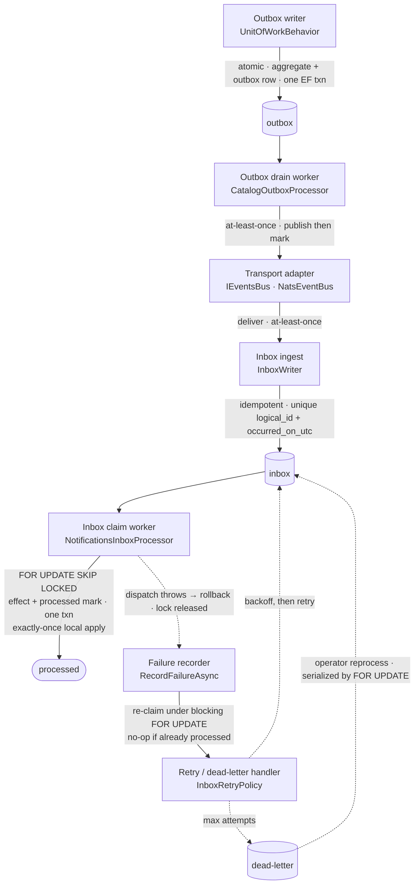

# Handoff components & failure boundaries

Diagram-as-code (Mermaid). Where [`container-view.md`](container-view.md) shows the
high-level flow, this shows the **components that own each handoff** and, more
importantly, **where the failure and recovery paths run**.

Solid edges are the happy path; **dashed edges are failure / recovery paths**.

## Component → code

| Component | Code | Pinned by |
| --------- | ---- | --------- |
| Outbox writer | `UnitOfWorkBehavior` | `CatalogProductWriteReliabilityTests` |
| Outbox drain worker | `CatalogOutboxProcessor` · `OutboxProcessorBase` | `CatalogOutboxReliabilityTests` |
| Transport adapter | `IEventsBus` (in-memory) · `NatsEventBus` (JetStream) | `NatsCrossProcessReliabilityTests` |
| Inbox ingest | `InboxWriter` | `NotificationsInboxReliabilityTests` |
| Inbox claim worker | `NotificationsInboxProcessor` | `InboxConcurrencyReliabilityTests` |
| Failure recorder | `RecordFailureAsync` (in `NotificationsInboxProcessor`) | `InboxConcurrencyReliabilityTests` |
| Retry / dead-letter handler | `InboxRetryPolicy` · `InboxDeadLetterReprocessor` | `InboxRetryPolicyTests` · `InboxDeadLetterReprocessTests` |

## Failure boundaries

- **Exactly-once *local* apply.** The effect and the `processed` mark commit in one
  transaction; a failed apply rolls back and recovers. Concurrent drainers claim rows
  with `FOR UPDATE SKIP LOCKED`, so the local effect is never double-applied.
- **Failure recording is lock-guarded too.** After a rollback the failure recorder runs
  in a *separate* transaction. It re-claims the row under a **blocking** `FOR UPDATE` and
  no-ops if another drainer already set `processed_on_utc` — so a losing drainer cannot
  overwrite a success with a spurious `retrying`/dead-letter status or metric. This closes
  a race found by a claim audit and fixed test-first; see the case study:
  [`../09-lessons-learned/inbox-stale-failure-write-race.md`](../09-lessons-learned/inbox-stale-failure-write-race.md).
- **Dead-letter reprocess is concurrency-safe.** Two operators reprocessing the same
  dead-letter serialize on a `FOR UPDATE` claim; it is requeued exactly once.
- **External effects are out of scope.** HTTP / email / webhook / payment are not covered
  by the exactly-once local-apply guarantee — the shipped dispatcher only writes to the
  same database.
- **The outbox has no publisher lease.** Multiple instances may publish the same row;
  correctness relies on the idempotent inbox, not on deduplicated publishing.

See [Guarantee boundaries & non-goals](../../README.md#guarantee-boundaries--non-goals)
for the complete fault model.
